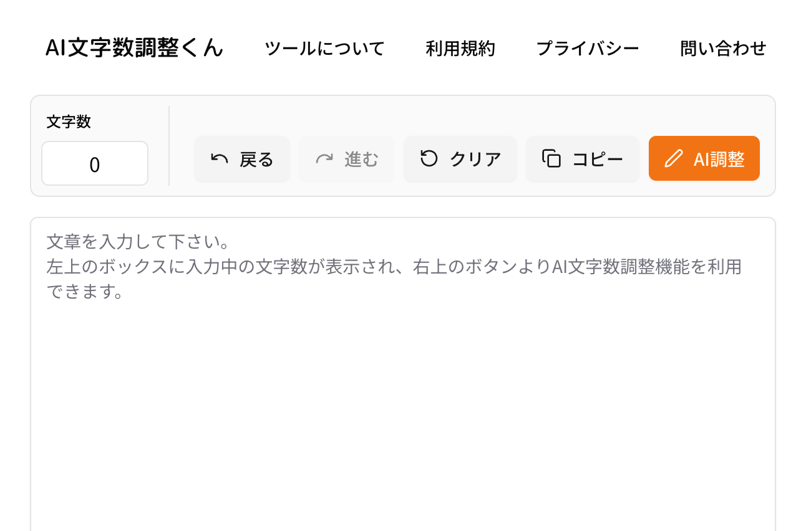

# AI文字数調整くん

<p align="center">
  
</p>

<p align="center">
  <strong>AI を活用して、文章を自然なまま指定文字数に調整する Web サービス</strong>
</p>

<p align="center">
  <a href="https://ai-chousei.com/">🔗 https://ai-chousei.com/</a>
</p>

---

## 📝 概要

「AI文字数調整くん」は、ユーザーが入力した文章に対して目標文字数を指定すると、**指定文字数の 90% 〜 100% の範囲**に文章を自然なまま調整してくれる Web サービスです。

レポート、ブログ記事、SNS 投稿、商品説明文など、文字数制限のあるあらゆるシーンで活用できます。

## 🎯 解決する課題

> ChatGPT などの汎用 AI に「○○文字で書いて」と依頼しても、指定した文字数通りに出力してくれない。

この「AI が文字数指定に従ってくれない」という課題を解決するために、本サービスを開発しました。

GenKit を用いた**最大 5 回のループ処理**で目標文字数に漸近させるロジックを実装し、**文字数指定の精度**を高めています。

## ✨ 実装機能

| 機能 | 説明 |
| --- | --- |
| 🔢 AI 文字数調整 | 目標文字数の 90% 〜 100% の範囲に、自然な文章のまま調整 |
| ↩️ 戻る / 進む | 編集履歴を遡ったり、取り消した操作をやり直すことが可能 |
| 📋 コピー | 調整後の文章をワンクリックでクリップボードへコピー |
| 🧹 クリア | 入力中の文章を一括リセット |

<p align="center">
  
</p>

## 🛠 使用技術

- **フロントエンド**: React 19 / Vite / TypeScript / TailwindCSS v4 / Radix UI
- **バックエンド**: Firebase Cloud Functions (Node.js 22) / GenKit / Vertex AI (Gemini)
- **インフラ**: Firebase Hosting / Firestore / Firebase App Check
- **その他**: LINE Messaging API (問い合わせ通知)

## 💡 工夫した点

過去に制作したアプリはユーザーが定着しないという課題がありました。原因を「**アプリが解決する課題がユーザーに伝わりづらい**」ことだと分析し、本プロジェクトでは以下を徹底しました。

- **機能の削ぎ落とし** — 文字数調整という主目的に集中し、不要な機能を一切実装しない
- **直感的なアプリ名** — 「AI文字数調整くん」という名前だけで用途が伝わるよう命名
- **SEO 対策の強化** — タイトル、メタ情報、OGP、構造化データを整備し、検索流入を最大化

## 📈 結果

- 🥇 SEO: 「**AI 文字数調整**」等のキーワードで**検索結果トップ**を獲得
- 👥 最高月間アクティブユーザー数 **3M（300万）** を達成
- 💰 広告収益による**黒字化**を達成（現在 1日あたり 約20円程度）

## 🏗 プロジェクト構成

モノレポ（npm workspaces）構成です。

```
.
├── apps/
│   ├── api/         # Firebase Cloud Functions (GenKit + Vertex AI)
│   │   └── src/
│   │       ├── adjustText/   # AI 文字数調整フロー
│   │       └── saveContact/  # 問い合わせフォーム (Firestore + LINE通知)
│   ├── web/         # フロントエンド (React + Vite)
│   │   ├── src/
│   │   │   ├── components/   # 再利用可能な UI コンポーネント
│   │   │   ├── screens/      # ページコンポーネント
│   │   │   ├── hooks/        # カスタムフック (useTextEdit 等)
│   │   │   └── service/      # API クライアント
│   │   └── assets/           # 画像・アイコン類
│   └── types/       # フロントエンド/バックエンド共有の型定義
├── firebase.json
└── package.json
```

## 🚀 動作環境

- Node.js **22** 以上
- npm
- Firebase CLI (`npm install -g firebase-tools`)

## ⚙️ セットアップ

```bash
# リポジトリをクローン
git clone <リポジトリURL>
cd text-count

# 全ワークスペースの依存関係をインストール
npm install

# Firebase CLI にログイン & プロジェクト選択
firebase login
firebase use --add
```

## 🧑‍💻 開発

```bash
# フロントエンドの開発サーバを起動 (http://localhost:5173)
npm run dev:web

# Firebase エミュレータを起動 (Functions: 5001, Firestore: 8080)
npm run dev:api

# フロントエンドとバックエンドを同時起動
npm run dev
```

## 🧪 テスト

```bash
# 全ワークスペースのテストを実行
npm test

# ワークスペースごとのテスト
npm run test:web   # Vitest (フロントエンド)
npm run test:api   # Jest   (バックエンド)
```

## 🏭 ビルド & デプロイ

```bash
# ビルド
npm run build

# 本番デプロイ
firebase deploy

# 個別デプロイ
firebase deploy --only functions
firebase deploy --only hosting
```

### シークレット設定 (初回のみ)

```bash
firebase functions:secrets:set LINE_CHANNEL_ACCESS_TOKEN "<YOUR_LINE_CHANNEL_ACCESS_TOKEN>"
```

## 🔗 リンク

- 🌐 サービスサイト: [https://ai-chousei.com/](https://ai-chousei.com/)
